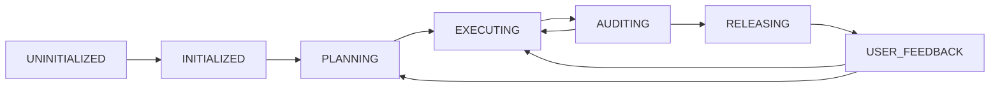

# STATE GRAPH

This document tracks the high-level operational state of the project. AI Agents use this state to determine their current responsibilities and behavior.

## Current State
**STATUS:** `UNINITIALIZED`

## Allowed States
1. **UNINITIALIZED**: The project has just been scaffolded. AI Agents MUST intercept all requests and initiate the Founder Interview to define `VISION_LOCK.md`.
2. **INITIALIZED**: The Founder Interview is complete. The system is ready for initial strategy formulation.
3. **PLANNING**: The AI Company (C-level agents) is currently drafting the roadmap, architecture, or features. No code is being written yet.
4. **EXECUTING**: The execution agents (engineers) are actively writing code, testing, and building features.
5. **AUDITING**: An active review is taking place (checking for alignment, technical debt, or bugs).
6. **RELEASING**: A version has passed Audit and is being deployed or shipped to users. AI prepares release notes and defines success metrics to observe.
7. **USER_FEEDBACK**: The team is actively collecting and analyzing real user feedback (bug reports, feature requests, UX complaints). AI must categorize feedback and feed prioritized insights back into the next PLANNING cycle.

## Transition Rules
- Only an Agent can update the **STATUS** in this file.
- Always update this file AND `.agents/ai-runtime/HANDOFF.md` simultaneously when transitioning states across roles.

## Valid Transitions

